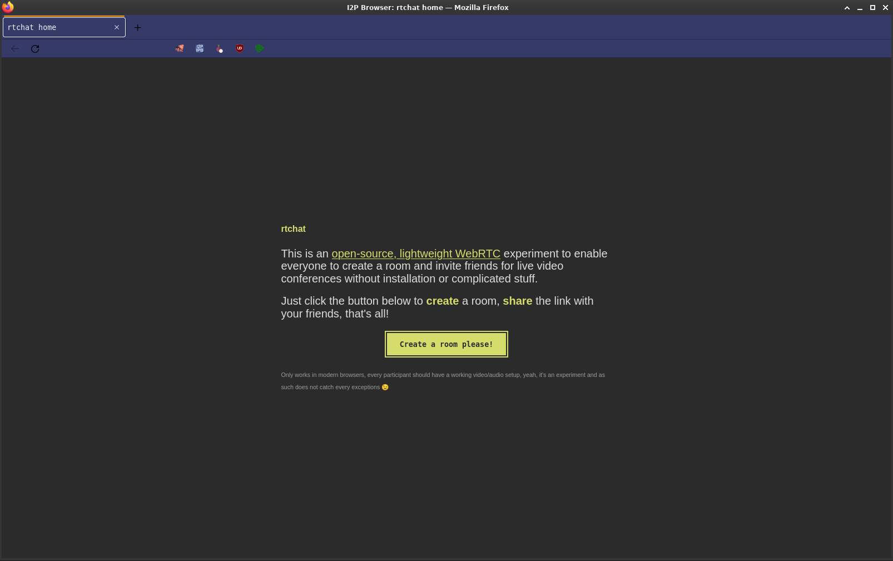
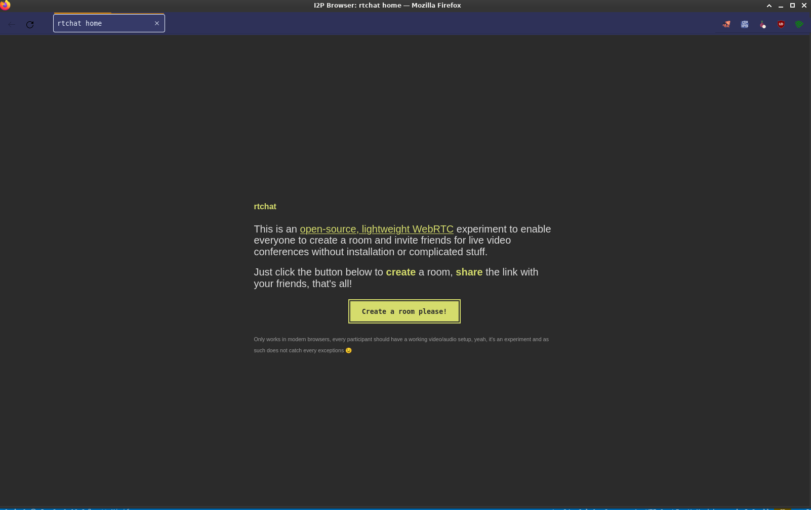

# userChrome.app.css

A Firefox UI customization that transforms the browser into an app container by removing standard browser interface elements. This creates a more focused, application-like experience while preserving essential tab management and extension functionality.




## 🎨 UI Modifications

### Hidden Elements
- URL Bar and Navigation Controls
- Menu Button (Hamburger Menu)
- Bookmarking Controls
- Library Access
- Pocket Integration
- Firefox Account Button
- Reader Mode
- Personal Toolbar
- Sidebar Controls

### Preserved Functionality
- Tab Bar (Limited to 50% viewport width)
- Browser Extension Buttons
- Essential Window Controls

### Layout Adjustments
- Toolbar Height: 32px
- Tab Bar Width: 50% of viewport
- Extension Button Area: Auto-adjusting with overflow handling
- Fullscreen Mode Support

## 🔧 Basic Setup

1. Enable custom CSS in Firefox:
```bash
about:config -> toolkit.legacyUserProfileCustomizations.stylesheets = true
```

2. Place in Firefox profile directory:
```bash
/path/to/firefox/profile/chrome/userChrome.css
```

## 📐 Layout Details

### Tab Section
```css
#TabsToolbar-customization-target {
    min-width: 50vw;
    max-width: 50vw;
    width: 50vw;
}
```

### Extension Button Area
```css
#nav-bar-customization-target {
    display: flex !important;
    flex: 0 1 auto;
}
```

### Toolbar Height
```css
:root {
    --uc-toolbar-height: 32px;
}
```

## 🎯 Use Cases

- Progressive Web Applications (PWAs)
- Single-site browsers
- Kiosk applications
- Distraction-free web applications
- Web application development testing
- Minimal browser interfaces

Compatible with Firefox 115+